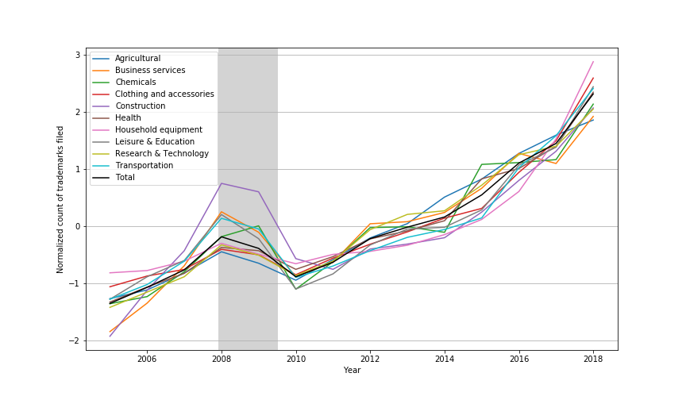

Here I document my proposed project for the Data Incubator program. The plots below were generated using the notebook [here](notebooks/jobs_and_stocks.ipynb).

**Table of Contents**
- [Introduction](#introduction)
- [The Proposed Project](#the-proposed-project)
  - [Tasks](#tasks)
  - [Expected Outcomes](#expected-outcomes)
  - [Privacy Concerns](#privacy-concerns)
- [Data Sources](#data-sources)
  - [Trademark Filings](#trademark-filings)
  - [Market Data](#market-data)

## Introduction

The number of newly founded establishments has been shown to correlate somewhat with the trends in the market indices.

<figure>
  
  

    <figcaption><i>Fig 1. Rate of new business creation by year</i></figcaption>
  

</figure>

The figure above shows that the number of young companies takes a noticeable downturn before and during both the 'Dot-com crash' in 2001 and the recession in late 2007. However, the drop in new businesses appears to decline even after the economy begins to recover.

A potentially better way to predict the recovery of the market after a crash is to use the rate of trademark filings. This has been discussed in the past (see [this 2004 article](https://www.nytimes.com/2004/04/05/business/patents-trademark-applications-one-theory-economic-gauge-remain-low-some-sectors.html) in The New York Times). The rational is as follows:
* As the economy worsens, the expectation that a new business will be successful is much lower. Thus:
  * Investors invest in fewer new businesses
  * Individuals don't start new businesses and the number of trademarks filed declines
* As the economy improves, entrepreneurs and investors are more optimistic about starting new businesses
  * Trademark filings increase in anticipation of the creation of said businesses (i.e. trademarks precede new businesses)

In the following figures it's obvious that the rate of trademark filing in the U.S. (*yellow dashed*) correlates more strongly with the market prices than rate of new businesses (*blue dashed*). For comparison, the number of private sector jobs (*green dashed*) is also shown, as it is typically used to measure the health of the economy.

<figure>
  
  

    <figcaption><i>Fig 2. Normalized filing rates, market prices, and newly established businesses between 1994-2015 (data from: data/preliminary_data.csv)</i></figcaption>
  

</figure>

<figure>
  
  

    <figcaption><i>Fig 3. Correlation plots between various markets (x-axis) and test measures (y-axis)</i></figcaption>
  

</figure>

It is clear that 'trademark filings' and 'private sector jobs' both correlate strongly with the market. This suggests that the rate of trademark filings could be an indicator of optimism/pessimism about the markets and thus predictive of market changes. However, monitoring trademarks has two distinct advantages:
* Trademark data is released on a daily basis, while job numbers are only available every month.
* Trademark numbers are far more robust, while Job numbers are often revised in subsequent months.

What's more, trademarks are typically assigned one or more [classifications](https://www.uspto.gov/trademark/trademark-updates-and-announcements/nice-agreement-tenth-edition-general-remarks-class) based on the intended uses. This allows a more fine grained approach to making industry-specific predictions. For instance, the following plot shows that the construction industry appears to have peaked more strongly before and recovered slightly slower than other industries after the recession in the late 2000's. This likely reflects the housing bubble and it's subsequent burst around this time.

<figure>
  
  

    <figcaption><i>Fig 4. Normalized count of trademarks filed by industry, data available since 2004</i></figcaption>
  

</figure>

Additionally, the agricultural industry has been slowing somewhat in recent years, potentially reflecting the recent trade tensions between the U.S. and China.

This has practical applications such as:
* identifying emerging industry changes (e.g. new technologies)
* predicting economic downturns/upturns by industry
* identifying saturation in a given industry (measure rate of rejected trademarks)

## The Proposed Project

The goal of this project is to see if we can use the rate at which trademarks are filed as a market indicator. 

### Tasks

Initial data pipeline
* [ ] Daily data downloader
* [x] Read/parse the data into a database containing only the useful components
* [ ] Define and extract informative metrics based on the data
  * Filing rate by industry
  * Weighting by industry sub-classes

Determine the best approach to modeling industry changes
* [ ] Simplest: Functional approximation
* [ ] Medium difficulty: Simple ML model
* [ ] Most complex: Deep learning neural network (RNNs, LSTM networks, etc...)

Dashboard for viewing predictions
* [ ] Change in the above metrics over time
* [ ] Present predictions from above modeling

Improvements should time permit
* [ ] Identify potentially connected industries (e.g. shared keywords in descriptions)
* [ ] Incorporate trademark rejection rates to identify industry saturation
* [ ] Showcase filing by region (city, state, country)

### Expected Outcomes

While the market data and the trademark filing rate appear to be correlated, it would be unrealistic to assume that filing data alone will provide perfect capability to predict major market fluctuations, let alone micro-fluctuations. The data is updated on a daily basis, so using it to predict changes on shorter timescales would be unreasonable.

Still, it is expected that some degree of predictability will be achievable using 'trademark filing rate'. This will be assessed by comparing how well the market fluctuations can be predicted under two conditions:
1. **Baseline**: The changes over time in the market prices themselves can predict major market fluctuations.
2. **Hypothesis**: Incorporating data on the rate of related trademark filings can improve the prediction of market changes by industry.

### Privacy Concerns
It should be noted that the raw data on trademark filings contains information on individuals involved with the filing. Care will be taken to reasonably ensure the personal details of individuals remain anonymous.

## Data Sources

### Trademark Filings
Data on trademark filing in the United States is made public by the United States Patent and Trademark Office (USPTO). Specifically, the USPTO provides access to the text, [Nice classifications](https://en.wikipedia.org/wiki/International_(Nice)_Classification_of_Goods_and_Services), and other filing data for trademark applications ([historical](https://developer.uspto.gov/product/trademark-annual-xml-applications) and [daily](https://developer.uspto.gov/product/trademark-daily-xml-file-tdxf-applications#product-files)). A breakdown of the XML file structure and the pieces that are likely to be used in this project is shown [here](data/trademark_data.md).

### Market Data
Because of the nature of this project, real-time market data is unnecessary. At best, daily market values should suffice to achieve the end goal. These can be obtained (freely) through the [Alpha Vantage API](https://www.alphavantage.co/documentation/). This API allows accessing open, close, high, and low price data as well as trading volume for a host of market symbols. A demonstration on how I plan to get this data is shown [here](notebooks/get_market_data.ipynb).
